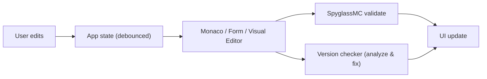
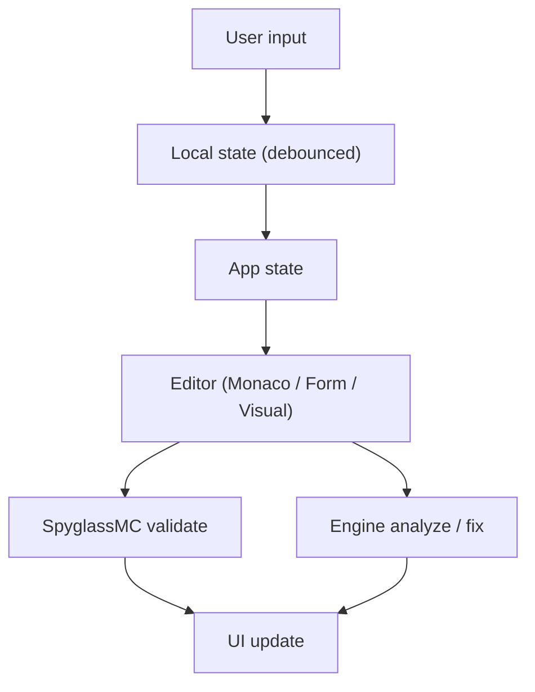

# 📖 Minex Datapack IDE — Documentation

<details>
<summary><strong>Table of contents</strong></summary>

- [About](#about)
- [For creators: a quick tour](#for-creators-a-quick-tour)
  - [Three ways to edit](#three-ways-to-edit)
  - [The Datapack Visual Editor](#the-datapack-visual-editor)
  - [Version checking](#checking-versions)
- [For developers: how it's built](#for-developers-how-its-built)
  - [Architecture](#architecture)
  - [Project layout](#project-layout)
  - [Data flow](#data-flow)
  - [Running it](#running-it)
- [Browser support](#browser-support)
- [Known limitations](#known-limitations)
- [Roadmap](#roadmap)
- [Credits](#credits)
- [License](#license)

</details>

---

## About

Minex Datapack IDE is a free, browser-based toolkit for making Minecraft datapacks. You can write them as code, build them visually with connected blocks, or use forms — and the tool checks your work against different Minecraft versions.

The live site is [minexind.github.io](https://minexind.github.io). This repository contains:

- **`web/`** — the IDE you see in the browser.
- **`src/`** — the `datapack-version-checker` engine (analysis, auto-fix, validation), plus a CLI and MCP server.

> 📸 **Screenshots** are referenced below but not yet committed. Drop your images into `docs/screenshots/` using the filenames shown.

---

## For creators: a quick tour

### Three ways to edit

No matter which view you pick, they all edit the same underlying file:

| View | Best for | Example files |
|------|----------|---------------|
| **Code** | Full control, copy-pasting from wikis | JSON, `.mcfunction`, SNBT |
| **Form** | Fast, mistake-proof editing | Recipes, loot tables, predicates, advancements, tags, `pack.mcmeta` |
| **Visual graph** | Seeing the whole function at once | `.mcfunction` |

### The Datapack Visual Editor

Think of it like wiring up blocks instead of writing a to-do list of commands.

- **Nodes** are the blocks. Each does one thing: a command, a condition, a function call, an effect, and so on.
- **Ports** are the little connectors. *Flow* ports (colour-coded by category) show the order things happen; *data* ports carry values — like a selector or a number — between nodes.
- **Compile** turns your graph into a `.mcfunction` file.
- **Decompile** does the reverse: paste a `.mcfunction` and get an editable graph back.


The editor includes a large library of node types:

| Category | Examples |
|----------|----------|
| Flow | trigger (`function_entry`), sequence, branch (condition), function call, return |
| Execute | `execute as/at/positioned/facing/condition/...` |
| Scoreboard | set score, add score, create objective, score condition |
| Entity | summon, kill, teleport, effect, tags, damage |
| World | particle, playsound, setblock, fill, clone, weather, time |
| Data | set, get, modify, remove |
| Values | selectors, numbers, positions, objectives |
| Utility | custom command (escape hatch), comment |

> 💡 **Tip:** If you're unsure where to start, use the *custom command* node as an escape hatch — it lets you paste any Minecraft command directly.

Invalid setups are flagged before you compile, so you won't waste time writing broken files.

### Checking versions

Press **Ctrl/Cmd + Shift + A** to analyze your whole pack. The tool lists problems and, where it can, offers a one-click fix. This is especially useful when you're updating a pack to a newer Minecraft version.

---

## For developers: how it's built

### Architecture



> The diagram above omits draft persistence (IndexedDB) and ZIP export for clarity.

### Two packages, one repo

| Path | Role | Runtime |
|------|------|---------|
| `src/` | `datapack-version-checker` engine — analysis, fixing, validation | Node.js, CLI, MCP server |
| `web/` | React IDE — Monaco, Visual Editor, forms, file tree | Browser |

### Project layout

```
.
├── src/                      # version-checker engine
│   ├── analyzer.ts  fixer.ts  mcdoc-check.ts  json-check.ts
│   ├── rules.ts  knowledge.ts  resource-knowledge.ts
│   ├── spyglass-analyze.ts  server.ts  mcp-server.ts
│   └── …
├── web/                      # the IDE (→ minexind.github.io)
│   └── src/
│       ├── components/       # IdePage, VisualEditor, editors, palette, …
│       ├── visual/core/      # compiler / decompiler / validator + node registry
│       ├── engine/           # Spyglass service, analysis, cache
│       ├── ide/              # pack-mcmeta / mcdoc editing, drafts
│       └── styles/
├── tests/  docs/  scripts/
└── package.json
```

### Data flow



- **Free-text inputs** use local state with debounced commits so typing stays smooth.
- **Monaco edits** sync to app state; the app tells SpyglassMC to validate.
- **Visual Editor** compiles its graph to the `.mcfunction` text on demand.

### Running it

```bash
npm install
npm run dev            # web dev server
npm run build          # engine (tsc) + web (vite) → web/dist
npm test               # engine tests (vitest)
cd web && npm install && npm run build   # build the web app only
```

End-to-end tests live in `web/e2e/` (Playwright):

| Suite | Covers |
|-------|--------|
| `ide.spec.ts` | Full IDE flows |
| `minimal.spec.ts` | Lightweight smoke test |
| `spyglass-bootstrap.spec.ts` | SpyglassMC integration |
| `visual-editor.mjs` | Visual Editor flows |

---

## Browser support

| Browser | Version |
|---------|---------|
| Chrome / Edge | 90+ |
| Firefox | 88+ |
| Safari | 14+ |

Requires modern JavaScript (ES2020) and CSS Grid / Flexbox.

---

## Known limitations

- ⚠️ The **terminal panel** shows logs only — it can't run a real shell.
- ⚠️ The **Visual Editor** compiles one function at a time (multi-function graphs are assembled per-function).
- ⚠️ SpyglassMC's data service needs **internet access** while you edit.

<details>
<summary>Older / less critical notes</summary>

- Monaco's minimap and code actions require additional setup in some builds.
- Very large packs (>1000 files) can slow down without virtual scrolling.

</details>

---

## Roadmap

- [ ] Editable multi-function projects in the Visual Editor
- [ ] xterm.js terminal integration
- [ ] Git integration
- [ ] Theme customization
- [ ] Offline support (Service Workers)
- [ ] Plugin / extension system

---

## Credits

Big thanks to the projects that make this possible:

| Project | What it provides | License |
|---------|------------------|---------|
| [Visual Studio Code](https://code.visualstudio.com/) | IDE UX inspiration (command palette, quick open, breadcrumbs, problems panel) | MIT |
| [misode / misode.github.io](https://github.com/misode/misode.github.io) | Reference for visual datapack editors | MIT |
| [SpyglassMC](https://spyglassmc.com/) | Minecraft data parsing & validation | MIT |
| [Monaco Editor](https://microsoft.github.io/monaco-editor/) (Microsoft) | Code editing component | MIT |
| [React Flow / @xyflow/react](https://reactflow.dev/) | Node-based Visual Editor canvas | MIT |
| [React](https://react.dev/) | UI framework | MIT |
| [TypeScript](https://www.typescriptlang.org/) | Type safety | Apache-2.0 |
| [Vite](https://vitejs.dev/) | Build tooling | MIT |
| [Playwright](https://playwright.dev/) | End-to-end testing | Apache-2.0 |

*Minecraft is a trademark of Mojang Studios. This project is not affiliated with Mojang or Microsoft.*

---

## License

Released under the [MIT License](LICENSE.md).
